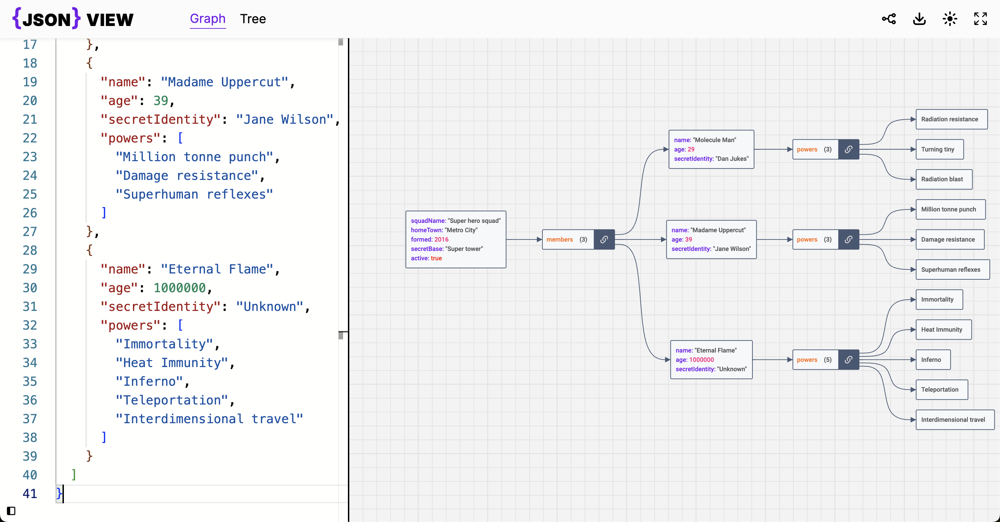

This is a Next.js project that takes a JSON input and transforms it into an interactive graph and tree visualization, using the Reaflow library for graph rendering and react-json-tree for tree representation.

## Getting Started
### Prerequisites

Ensure you have the following installed on your machine:

- Node.js (v14 or later)
- npm 

### Installation

Clone the repository and install dependencies:
```bash
git clone https://github.com/KD-ayoub/json-v.git
cd json-v
npm install
npm run dev
```
Open http://localhost:3000 in your browser to see the application.

## Features

- JSON Input: Accepts JSON data via an input field.
- Graph Visualization: Interactive graph representation using Reaflow.
- Tree Visualization: Hierarchical tree view rendered with react-json-tree.
- Dynamic Updates: Automatically refreshes visualizations upon JSON changes.




